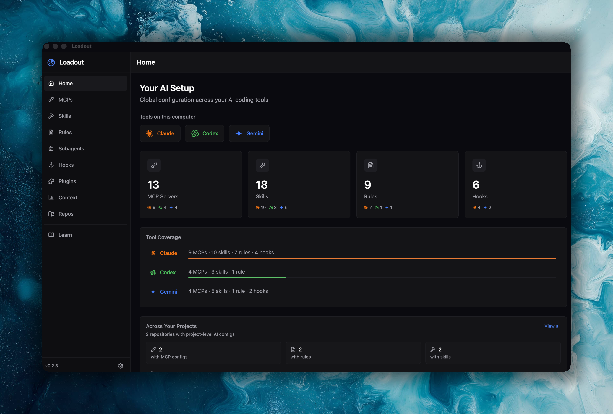
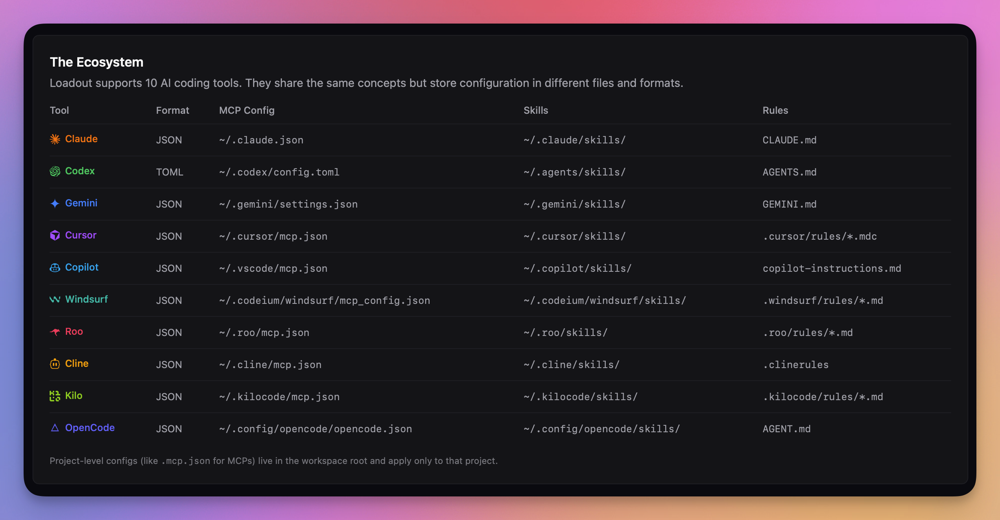
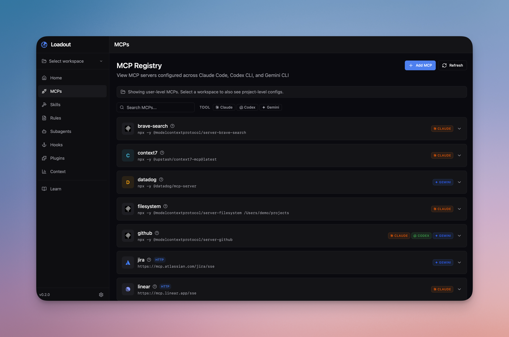
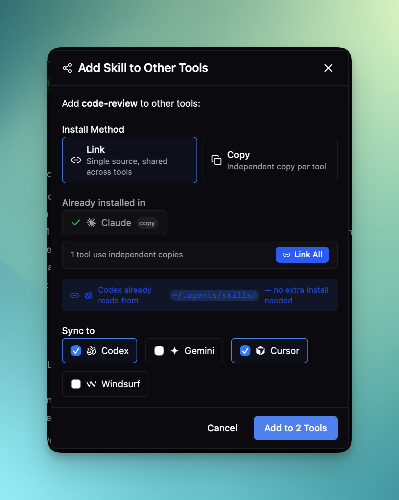
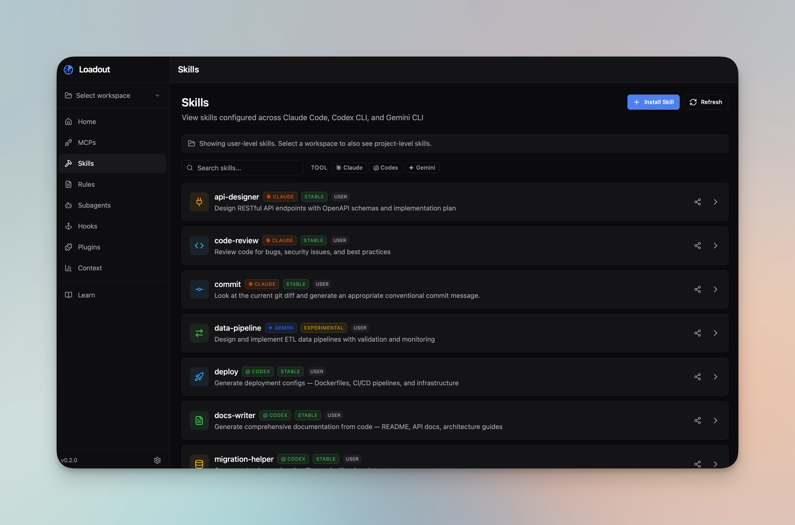
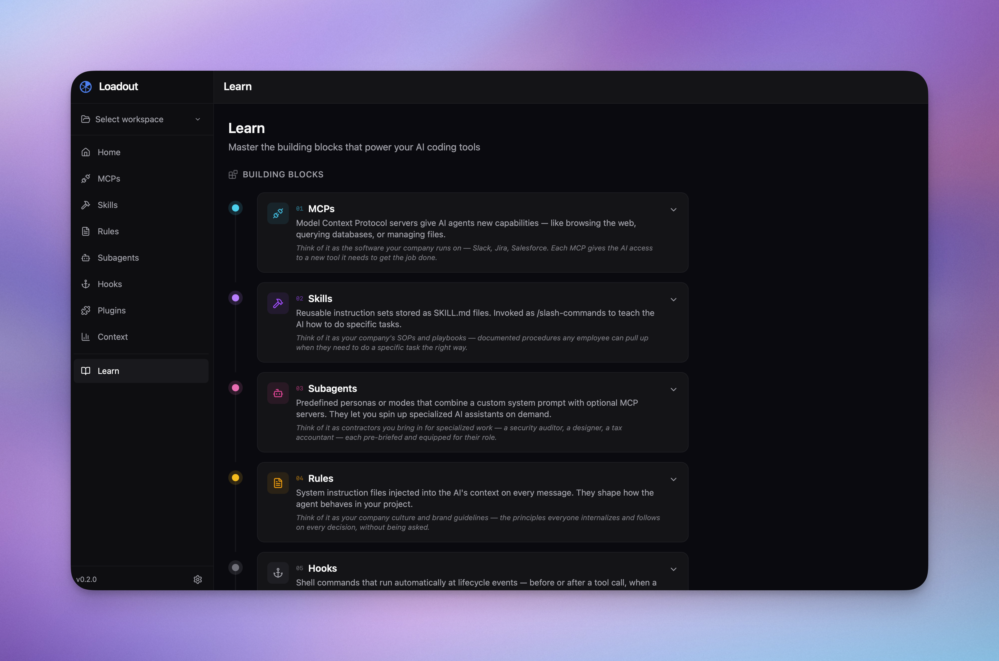

<p align="center">
  
</p>

<p align="center">
  <a href="https://github.com/AmElmo/loadout/releases/latest"></a>
  <a href="https://github.com/AmElmo/loadout/releases"></a>
  <a href="https://github.com/AmElmo/loadout/blob/main/src-tauri/Cargo.toml#L6"></a>
  <a href="https://github.com/AmElmo/loadout/actions/workflows/release.yml"></a>
</p>

<p align="center">
  One desktop app to manage MCPs, skills, rules, hooks, and subagents across all your AI coding tools.
</p>

---

AI coding assistants store their configs in scattered JSON, TOML, and markdown files across your home directory and project folders. Loadout scans all of them, shows you what's configured where, and lets you sync settings between tools — without touching a terminal.

<p align="center">
  
</p>

## Install

Download the latest release for your platform:

<!-- DOWNLOAD_TABLE_START -->
| Platform | Download |
|----------|----------|
| macOS (Apple Silicon) | [`.dmg`](https://github.com/AmElmo/loadout/releases/latest/download/Loadout_0.4.0_aarch64.dmg) |
| macOS (Intel) | [`.dmg`](https://github.com/AmElmo/loadout/releases/latest/download/Loadout_0.4.0_x64.dmg) |
| Linux | [`.AppImage`](https://github.com/AmElmo/loadout/releases/latest/download/Loadout_0.4.0_amd64.AppImage) / [`.deb`](https://github.com/AmElmo/loadout/releases/latest/download/Loadout_0.4.0_amd64.deb) |
| Windows | [`.exe`](https://github.com/AmElmo/loadout/releases/latest/download/Loadout_0.4.0_x64-setup.exe) / [`.msi`](https://github.com/AmElmo/loadout/releases/latest/download/Loadout_0.4.0_x64_en-US.msi) |
<!-- DOWNLOAD_TABLE_END -->

Auto-updates are built in — Loadout checks for new versions on launch and every 4 hours.

Supports **Claude Code**, **Codex CLI**, **Gemini CLI**, **Cursor**, **Copilot**, **Windsurf**, **Roo**, **Cline**, **Kilo**, and **OpenCode**.

<p align="center">
  
</p>

## What You Can Do

**See everything in one place.** Loadout discovers MCPs, skills, rules, hooks, subagents, and plugins across all your AI tools — both global (`~/.claude/`, `~/.codex/`, `~/.gemini/`) and project-level (`.claude/`, `.gemini/`).

<p align="center">
  
</p>

**Sync configs between tools.** Add an MCP server to Claude, then sync it to Codex and Gemini with one click. Same for skills and agents.

<p align="center">
  
</p>

**Manage skills across tools.** Browse, import, and install skills with drag-and-drop. Loadout groups identical skills across tools and flags conflicts when content differs.

<p align="center">
  
</p>

**Catch conflicts.** When the same skill or agent has different content across tools, Loadout flags it so you can decide which version to keep.

**Manage your context budget.** The Context page estimates how many tokens your rules, skills, and MCP definitions consume — split into always-loaded (idle) and on-demand (active).

**Test MCP health.** Check whether your MCP servers are reachable and responding before you wonder why a tool isn't working.

**Preview content.** Markdown rendering for skills, rules, and agent prompts — no more reading raw files.

**Learn the ecosystem.** The Learn page explains MCPs, skills, subagents, rules, hooks, plugins, context windows, and scoping — all in one place.

<p align="center">
  
</p>

## Features

| Feature | Claude | Codex | Gemini | Cursor | Others |
|---------|:------:|:-----:|:------:|:------:|:------:|
| MCP management | ✅ | ✅ | ✅ | ✅ | — |
| Skills | ✅ | ✅ | ✅ | — | — |
| Rules / prompts | ✅ | ✅ | ✅ | ✅ | ✅ |
| Hooks | ✅ | ✅ | ✅ | ✅ | — |
| Subagents | ✅ | — | ✅ | — | — |
| Plugins | ✅ | — | ✅ | ✅ | — |
| Cross-tool sync | ✅ | ✅ | ✅ | — | — |
| Context window estimation | ✅ | ✅ | ✅ | — | — |

Additional capabilities:
- Workspace discovery — finds project-level configs and git repos
- Drag-and-drop skill import from URLs or local files
- Keyboard shortcuts for fast navigation
- Light, dark, and system themes
- Resizable sidebar with persistent layout

## Development

### Prerequisites

- [Node.js](https://nodejs.org/) 20+
- [pnpm](https://pnpm.io/) 10+
- [Rust](https://www.rust-lang.org/tools/install) (stable toolchain)
- Platform dependencies for Tauri — see the [Tauri prerequisites guide](https://v2.tauri.app/start/prerequisites/)

### Quick Start

```sh
git clone https://github.com/AmElmo/loadout.git
cd loadout
pnpm install
pnpm tauri dev
```

### Run Against Test Fixtures

To use demo data instead of your real home directory:

```sh
pnpm tauri:dev:fixtures
```

This loads configs from `fixtures/home/` — a mock home directory with Claude, Codex, and Gemini configurations. The `LOADOUT_HOME` env var is only honored in debug builds.

### Build

```sh
pnpm tauri build
```

### Project Structure

```
src/                     React frontend (Vite + Tailwind)
├── components/          UI components by feature
├── pages/               Top-level page components
├── stores/              Zustand state management
├── lib/api/             Tauri command wrappers
├── hooks/               Custom React hooks
└── types/               TypeScript interfaces (mirror Rust structs)

src-tauri/               Rust backend (Tauri 2.x)
├── src/commands/        IPC command handlers
├── src/scanners/        Filesystem scanners
├── src/parsers/         Config file parsers
└── src/writers/         Config file writers (atomic writes + backups)
```

### Tech Stack

- **Frontend**: React 19, Vite, Tailwind CSS 4, Zustand, TanStack Query
- **Backend**: Rust, Tauri 2.x, Serde
- **Package Manager**: pnpm

### Conventions

- `camelCase` in TypeScript/JSON, `snake_case` in Rust with `#[serde(rename_all = "camelCase")]`
- `@/` path alias for `src/` imports
- `cn()` utility (clsx + tailwind-merge) for conditional Tailwind classes
- Conventional Commits (`feat:`, `fix:`, `chore:`)
- Sensitive env vars masked with `***` in the UI

## Contributing

Contributions are welcome. Please use [Conventional Commits](https://www.conventionalcommits.org/) for commit messages and open a PR against `main`.

## License

[MIT](src-tauri/Cargo.toml#L6) — Julien Berthomier
